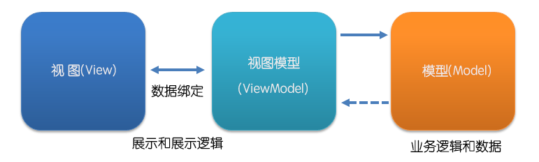

# 02、基础特性

### 前言
+ 无论前端框架如何变化，它需要处理的事情依旧是**模板渲染**、**事件绑定**、**处理用户交互（输入信息或鼠标操作）**，只不过提供了不同的写法和理念

### 实例

+ 通过 new Vue({ ... }) 创建 Vue 实例；传入一个选项对象，包含数据、模板、挂载元素、方法、生命周期钩子等选项
+ 一个 Vue 实例相当于一个 MVVM 模式中的 ViewModel；如上图所示
+ 

### 选项

##### el 
+ 类型为字符串
+ DOM 元素或函数
+ 其作用是为实例提供挂载元素

##### template 
+ 类型为字符串
+ 默认会将 template 值替换挂载元素（即 el 值对应的元素）
+ 注意：组件模板需要有一个根元素

##### data 
+ 定义数据
+ 注意：必须是一个函数，并且返回值是原始对象
+ 注意：data 中的属性和 props 中的不能重名
+ 注意：只有初始化时传入的对象才是响应式的
+ 需要在实例化之后加入响应式变量，需要调用实例 $set 方法
+ 提示：应尽量在初始化的时候，把所有的变量都设定好，如果没有值，也可以用 undefined 或 null 占位

##### props
+ 获取数据
+ 提示：需要在初始化时预设好

##### methods
+ 定义方法
+ 使用 v-on 指令来监听 DOM 事件并指定方法

##### computed
+ 计算属性：展示的数据往往需要经过一些处理
+ 提供的函数将用作属性的 getter 函数
+ 计算属性的 setter 方法，则在更新属性时带来便利；
  + 例如：在处理商品价格的时候，后端往往会把价钱定义成以分为单位的整型，避免在处理浮点类型数据时产生的问题。而前端则需要把价钱再转成元进行展示，而且如果需要对价钱进行修改的话，则又要把输入的价格再恢复到分传给后端，很是繁琐。
+ 避免在模板中加入过重的业务逻辑，保证模板的结构清晰和可维护性
```
computed : {
  price : {
    // 分
　　set : function(newValue) {
　　　this.cents = newValue * 100;
　　},
    // 元
　　get : function() {
　　　return (this.cents / 100).toFixed(2);
　　}
　}
}
```

### 生命周期
+ Vue 实例在创建时有一系列的初始化步骤，例如：建立数据观察，编译模板，创建数据绑定等
+ 在此过程中，可以通过一些定义好的生命周期钩子函数来运行业务逻辑

##### beforeCreate
+ 在实例开始初始化时同步调用
+ 此时数据观测、事件等都尚未初始化
+ 可以通过 localStorage/cookie 来判断用户是否登录

##### created
+ 在实例创建之后调用
+ 此时已完成数据绑定、事件方法；即：可访问观测数据和方法
+ 但尚未开始 DOM 编译，即未挂载到文档(document)中；即：无法访问 $el
+ 可发送 ajax 请求获取数据

##### beforeMount
+ 编译模板并由 Vue 更新虚拟 DOM 之后调用该方法
+ 不保证 $el 已插入文档
+ 如果要操作 DOM，需要通过实例的 $nextTick 方法

##### mounted
+ 在编译结束时调用
+ 此时所有指令已生效，数据变化已能触发 DOM 更新
+ 可以访问模板（this.$el）以及操作 DOM
+ 最常用是：获取组件的数据和修改 DOM，通常用于集成非 Vue 库或插件

##### beforeDestroy
+ 在开始销毁实例时调用
+ 此刻实例仍然有效

##### destroyed
+ 在实例被销毁之后调用
+ 此时所有绑定和实例指令都已经解绑，子实例也被销毁

##### beforeUpdate
+ 在实例挂载之后，再次更新实例时会调用该方法
+ 此时尚未更新 DOM 结构
+ 允许在组件呈现之前获取组件上任何观测数据的新状态

##### updated
+ 在实例挂载之后，再次更新实例并更新完 DOM 结构后调用
+ 对于调试很有用
+ 注意：不要使用更新方法来更改状态，computed 和 watch 最适合

##### activated
+ 需要配合动态组件 keep-live 属性使用
+ 在动态组件初始化渲染的过程中调用该方法
+ 可以清理事件、定时器

##### deactivated
+ 需要配合动态组件 keep-live 属性使用
+ 在动态组件移出的过程中调用该方法
+ 可用于通知远程服务器组件已被销毁

### 数据绑定
+ vue 作为数据驱动视图的框架
+ 如何将数据在视图中展示出来？
  + 传统的 Web 项目中，这一过程往往是通过后端模板引擎来进行数据和视图的渲染，例如：PHP 的 smarty；但这样导致的情况是前后端语法会交杂在一起，前端 HTML 文件中需要包含后端模板引擎的语法，而且渲染完成后如果需要再次修改视图，就只能通过获取 DOM 的方法进行修改，并手动维持数据和视图的一致
  + Vue 的核心是一个响应式的数据绑定系统，建立绑定后，DOM 将和数据保持同步，这样就无需手动维护 DOM，使代码能够更加简洁易懂、提升效率

##### 数据绑定语法
+ 文本插值：使用的是双大括号标签 {{ color }}，为"Mustache"语法（源自前端模板引擎Mustache.js）
+ 绑定表达式：{{ index == 0 ? 'a' : 'b'}}
+ 属性绑定：v-bind:id="uid" 可简写为 :id="uid"
+ 过滤器：表达式后添加可选的过滤器，以管道符"|"指示；
  + 可以串联：{{ name | filterA | filterB }}
  + 可以接收参数：{{ message | filterA('wahaha', arg2) }}
+ 指令：可以理解为当表达式的值发生改变时，会有些特殊行为作用到绑定的 DOM 上；指令通常会直接书写在模板的 HTML 元素中，而为了有别于普通的属性，指令是带有前缀的 v- 的属性；写法上来说，指令的值限定为绑定表达式，因此绑定表达式及过滤器规则在这里也适用

### 表单控件
+ v-model 指令对表单元素进行双向数据绑定，在修改表单元素值的同时，实例中对应的属性值也同时更新，反之亦然

### class 与 style 绑定
+ 在开发过程中，经常会遇到动态添加类名或直接修改内联样式，如：选项卡切换
+ class、style 都是 DOM 元素的属性，可使用 v-bind 指令对这两个属性进行数据绑定，如：:style="myStyle"
+ vue 对这两个属性单独做了增强处理，表达式的结果类型除了字符串之外，还可以是对象和数组
+ :style 在运行时进行前缀探测，会根据需要自动添加厂商前缀

### 模板渲染
+ 当获取后端数据后，会把它按照一定的规则加载到写好的模板中，输出成浏览器中显示的 HTML，这个过程称之为渲染

#### 前后端渲染对比
+ 早期的 web 项目一般是在服务器端进行渲染，服务器进程从数据库获取数据后，利用后端模板引擎，甚至直接在 HTML 模板中潜入后端语言（如：php），将数据加载进来生成 HTML，然后通过网络传输到用户的浏览器中，最后被浏览器解析成可见的页面
+ 前端渲染则是在浏览器中利用 JS 把数据和 HTML 模板进行结合
+ 前端渲染的优点
  + 原本需要后端渲染的任务转移给前端，减轻了服务器的压力
  + 业务分离，后端只需要提供数据接口
  + 前端在开发时不需要部署对应的后端环境，通过一些代理服务器工具久能远程获取后端数据进行开发
  + 能够提升开发效率
+ 后端渲染的优点
  + 对搜索引擎友好
  + 首页加载时间短，后端渲染加载完成后就直接显示 HTML，而前端渲染在加载完成后需要有段 JS 的渲染时间

### 模板引擎
+ v-if、v-else、v-show、v-for 内置的指令来说明模板和数据间的逻辑关系，基本就构成了模板引擎的主要部分

#### 条件渲染
+ v-if、v-else 作用是根据数据值来判断是否输出 DOM 元素以及包含的子元素
+ v-else 必须紧跟 v-if，不然该指令不起作用
+ v-show、v-else 可根据条件展示元素；v-show 元素的使用会渲染并保持在 DOM 中，只是切换 css 的 display 属性

#### v-if vs v-show
+ v-if 引起 DOM 操作级别的变化
+ v-if 切换时，回有一个布局编译、卸载的过程，因为 v-if 中的模板可能包括数据绑定或子组件
+ v-show 仅发生样式的变化
+ v-if 是惰性的，如果初始条件为假，v-if 本身什么都不会做，而 v-show 则任会进行正常的操作，然后把 css 的 display 属性设置为 none
+ v-if 有更高的切换消耗
+ v-show 有更高的初始渲染消耗

#### 列表渲染
+ v-for 指令主要用于列表渲染，将根据接收到的数组重复渲染 v-for 绑定到的 DOM 元素以及内部的子元素，并且可以通过设置别名的方式，获取数组中的数据渲染到节点中
+ 以下两种情况无法触发视图更新
  + 通过索引直接修改数组元素
  + 直接修改数组的长度
+ 建议尽可能在使用 v-for 时提供 key，以获取性能上的提升

### 事件绑定与监听
+ 当模板渲染完成之后，就可以进行事件的绑定和监听了
+ v-on 指令用来监听 DOM 事件，通常在模板内直接使用，然后绑定事件
+ v-on: 后参数接收所有的原生事件名称
+ 通过 v-on 可以绑定实例选项属性 methods 中的方法作为事件的处理器
+ v-on 也支持内联的 JS 语句，但仅限一个语句
+ 同一个元素可以通过 v-on 绑定多个相同事件函数，执行顺序按书写顺序
+ 事件修饰符
+ 按键修饰符
  + 自定义按键别名：Vue.config.keyCodes.f1 = 112

#### 与传统事件绑定的区别
+ 